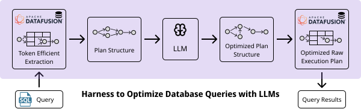

<div align="center">

# ⚡ Making Databases Faster with LLM Evolutionary Sampling

[](https://arxiv.org/abs/2602.10387) [](LICENSE) [](https://www.python.org/downloads/)

**Mehmet Hamza Erol<sup>1</sup>, Xiangpeng Hao<sup>2</sup>, Federico Bianchi<sup>3</sup>, Ciro Greco<sup>4</sup>, Jacopo Tagliabue<sup>4</sup>, James Zou<sup>3 1</sup>**

<sup>1</sup>Stanford University &nbsp; <sup>2</sup>University of Wisconsin-Madison &nbsp; <sup>3</sup>TogetherAI &nbsp; <sup>4</sup>Bauplan

---

</div>

<div align="center">
    
</div>

This repository provides tools for optimizing SQL query execution plans using LLM-driven evolutionary sampling. For SQL queries, it obtains and modifies physical execution plans, benchmarks them, and transfers optimizations across dataset scale factors, all orchestrated through a Python API backed by [Modal](https://modal.com) cloud sandboxes and a patched [DataFusion](https://datafusion.apache.org/) engine.

## Quick Example

```python
from dbplanbench import optimize_queries

QUERY = "SELECT * FROM ... WHERE ... ORDER BY ..."

opt_result = optimize_queries(
    queries=[QUERY],
    dataset="tpcds",
    scale_factor=3,
    n_steps=2,
    n_samples_per_step=5,
    top_k_patches=1,
    n_runs=5,
)

single_plan = opt_result.optimization_outcome[0]
best_patch = single_plan.patch[0]
summary = opt_result.summary
```

## Architecture Overview

<div align="center">
    
</div>

The **Python API** runs on your machine and orchestrates the entire pipeline. **Modal sandboxes** run the patched DataFusion engine (built from the `datafusion_patched/` directory in this repo) inside ephemeral cloud containers &mdash; they plan, execute, and benchmark queries, writing results to **S3**. The **LLM** proposes execution-plan optimizations as JSON Patch operations, which the API validates by sending patched plans back to Modal.

## Setup

<details>
<summary>Show Python environment and env file setup</summary>

### Python Environment

Python 3.10 or higher is required. Install dependencies with [uv](https://docs.astral.sh/uv/):

```bash
uv sync
source .venv/bin/activate
```

### Environment Variables

Copy `local.env` to `.env` and fill in your values as you complete the setup steps below:

```bash
cp local.env .env
```

`local.env` lists all required environment variables with placeholder values. `.env` is gitignored.

</details>

### AWS S3 Setup

<details>
<summary>Show AWS S3 setup steps</summary>

Modal sandboxes write results to S3, and the local client retrieves them. Create your own S3 bucket with any name you choose.

1. **Create an S3 bucket**
   - Open the S3 console and click **Create bucket**.
   - Choose any bucket name (e.g., `my-faster-dbs-bucket`).
   - Keep the default settings, and click **Create bucket**.

2. **Set your bucket name in `.env`**
   ```
   S3_BUCKET_NAME=your-bucket-name-here
   ```

3. **Create IAM credentials**
   - Open the IAM console and go to **Users** -> **Create user**.
   - On **Set permissions**, choose **Attach policies directly**.
   - Click **Create policy**, go to the **JSON** tab, and paste (replace `YOUR_BUCKET_NAME` with your actual bucket name):
     ```json
     {
       "Version": "2012-10-17",
       "Statement": [
         {
           "Effect": "Allow",
           "Action": [
             "s3:PutObject",
             "s3:GetObject"
           ],
           "Resource": "arn:aws:s3:::YOUR_BUCKET_NAME/*"
         },
         {
           "Effect": "Allow",
           "Action": "s3:ListBucket",
           "Resource": "arn:aws:s3:::YOUR_BUCKET_NAME"
         }
       ]
     }
     ```
   - Save the policy and attach it to the user.
   - Finish **Review and create** to create the user.

4. **Add credentials to `.env`**
   - Go to IAM -> Users -> your user -> **Security credentials** -> **Create access key**.
   - Choose the **Local code** use case, then create the key.
   - Copy the **Access key ID** and **Secret access key** immediately (they are shown only once).
   - Add them to `.env`:
     ```
     AWS_ACCESS_KEY_ID=your_access_key_id_here
     AWS_SECRET_ACCESS_KEY=your_secret_access_key_here
     ```

</details>

### Modal Setup

<details>
<summary>Show Modal setup steps</summary>

Create a [Modal](https://modal.com) account and authenticate:

```bash
python3 -m modal setup
```

This creates `~/.modal.toml` with your Modal credentials. Open the file, grab the following credentials, and add them to `.env`:

```
MODAL_TOKEN_ID=your_token_id_here
MODAL_TOKEN_SECRET=your_token_secret_here
```

Next, create a Modal secret for AWS on the [Modal dashboard](https://modal.com/secrets) so that sandboxes can access your S3 bucket:

- Click **Create new secret** and choose **AWS** from the menu.
- Name the secret `s3-aws-credentials`.
- Paste your `AWS_ACCESS_KEY_ID` and `AWS_SECRET_ACCESS_KEY`, then save.

Note: the secret name `s3-aws-credentials` in Modal must match `AWS_SECRET_NAME` in `src/modal_controller/constants.py`.

</details>

### LLM Setup

<details>
<summary>Show LLM setup steps</summary>

This project uses [LiteLLM](https://docs.litellm.ai/) for LLM inference. Add your LLM API key to `.env`. This project uses GPT-5 by default:

```
OPENAI_API_KEY=your_openai_api_key_here
```

For other providers, check the [LiteLLM documentation](https://docs.litellm.ai/).

</details>

---

## Quick Start

See `notebooks/examples.ipynb` for a self-contained walkthrough that:

- Generates synthetic SQL queries with LLMs
- Optimizes their execution plans via evolutionary sampling
- Transfers optimizations across dataset scale factors
- Benchmarks at both scales and compares `improvement_x` side-by-side

Here's a condensed version:

```python
from dbplanbench import (
    generate_queries,
    optimize_queries,
    scale_optimizations,
    benchmark_plans,
    benchmark_queries,
    get_engine_plans,
)
from dbplanbench_types import PatchedPlan
```

### 1. Generate Queries
<details>
<summary> Generate synthetic SQL queries with LLMs by specifying a dataset and desired complexity distribution. </summary>

```python
gen_result = generate_queries(
    dataset="tpcds",
    complexity_distribution={5: 2, 6: 1},
    n_queries=3,
    scale_factor=3,
)
queries = gen_result.queries  # list of validated SQL strings
# gen_result.summary has per-complexity generation and validation counts
# gen_result.metadata has per-query details (aligned to queries)
```

</details>

### 2. Optimize Queries

```python
opt_result = optimize_queries(
    queries=queries,  # list of SQL strings
    dataset="tpcds",
    scale_factor=3,
    n_steps=2,
    n_samples_per_step=5,
    top_k_patches=1,
    n_runs=5,
)
# opt_result.optimization_outcome is a list of PatchedPlan objects, one per query.
# Each PatchedPlan has:
#   - base_plan: the engine's original execution plan (dict with "structure" and
#     "succinct_table_info")
#   - patch: a list of optimization patches, sorted best-to-worst. Each patch is
#     a list of JSON Patch ops, [] (no-op), or None (unavailable).
# opt_result.summary contains outcome rates and improvement statistics.
```

### 3. Scale Optimizations to a Larger Dataset

```python
# modal_resources configures the Modal sandbox resources (CPU, memory, timeouts)
# used during planning and validation at the target scale.
scale_result = scale_optimizations(
    queries=queries,
    plans=opt_result.optimization_outcome,
    source_scale_factor=3,
    target_scale_factor=6,
    dataset="tpcds",
    modal_resources={"memory": (8 * 1024, 8 * 1024)},  # 8 GB RAM for SF6
)
# scale_result.scaled_plans: PatchedPlan list transferred to SF6
# scale_result.transfer_failures: per-query error string (None = OK)
```

### 4. Benchmark Plans
<details>
<summary>Build benchmark plans: for each query, compare the best optimization against the base engine plan.</summary>

```python
bench_plans = []
for patched_plan in opt_result.optimization_outcome:
    # Patches are sorted best-to-worst; None means no meaningful optimization found.
    best_patch = patched_plan.patch[0] if patched_plan.patch[0] is not None else []
    # Evaluate both: optimized plan first, then base plan (empty patch [])
    bench_plans.append(PatchedPlan(
        base_plan=patched_plan.base_plan,
        patch=[best_patch, []],
    ))

result = benchmark_plans(bench_plans, dataset="tpcds", scale_factor=3, n_runs=5)
# result.results[i][0] = optimized plan measurement
# result.results[i][1] = base plan measurement

# Interpret benchmark results — access execution_time.min and compute improvement_x:
for i, per_query in enumerate(result.results):
    opt_time = per_query[0].get("benchmark_stats", {}).get("execution_time", {}).get("min")
    base_time = per_query[1].get("benchmark_stats", {}).get("execution_time", {}).get("min")
    if opt_time and base_time:
        improvement_x = base_time / opt_time
        print(f"Query {i}: {improvement_x:.2f}x improvement ({base_time:.1f}s -> {opt_time:.1f}s)")
```
```python
# Or benchmark raw queries directly (plans them automatically):
result = benchmark_queries(queries, dataset="tpcds", scale_factor=3, n_runs=5)
```

</details>

### 5. Inspect Engine Plans
<details>
<summary>Inspect engine plans for the given queries.</summary>

```python
planning = get_engine_plans(queries, dataset="tpcds", scale_factor=3)
for i, plan in enumerate(planning.plans):
    if plan:
        print(f"Query {i}: {list(plan.keys())}")
    else:
        print(f"Query {i}: FAILED - {planning.errors[i]}")
```

</details>

---

For detailed API documentation, return types, and troubleshooting, see [`src/README.md`](src/README.md).

## Local Development

To build, test, and modify the patched DataFusion engine locally (instead of only in Modal sandboxes), you need:

1. **Rust toolchain** — install via [rustup](https://rustup.rs/)
2. **Protocol Buffers compiler (`protoc`)**:
   - **macOS (Homebrew):** `brew install protobuf`
   - **Ubuntu/Debian:** `sudo apt-get install -y protobuf-compiler`
   - **Arch:** `sudo pacman -S protobuf`

Then install with the `local` extra:

```bash
uv sync --extra local
```

This builds the patched DataFusion wheel from `datafusion_patched/` and installs the `datafusion` Python package into your environment. You can then `import datafusion` and use it locally for development and testing. This step is not required for normal usage — Modal sandboxes build the engine themselves.

## Citation

If you find this work useful, please consider citing:

```bibtex
@misc{erol2026makingdatabasesfaster,
  title={Making Databases Faster with LLM Evolutionary Sampling},
  author={Erol, Mehmet Hamza and Hao, Xiangpeng and Bianchi, Federico and Greco, Ciro and Tagliabue, Jacopo and Zou, James},
  year={2026},
  eprint={2602.10387},
  archivePrefix={arXiv},
  primaryClass={cs.DB},
  url={https://arxiv.org/abs/2602.10387},
}
```

## License

See [LICENSE](LICENSE) for details.
